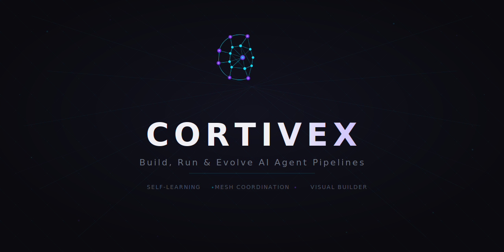
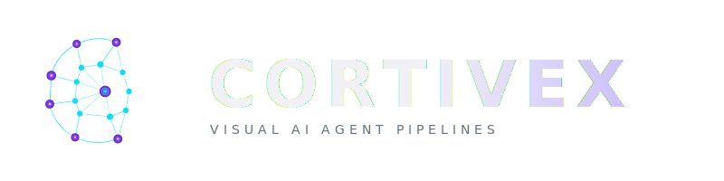

<p align="center">
  
</p>

<h1 align="center">Cortivex: AI Agent Pipeline Orchestration</h1>

<p align="center">
  <em>Deploy specialized AI agents in coordinated pipelines with self-learning capabilities, filesystem-based mesh coordination, and zero-infrastructure setup.</em>
</p>

<p align="center">
  
  
  
  
  
  
</p>

<p align="center">
  <a href="#why-cortivex">Why Cortivex</a> &middot;
  <a href="#getting-started">Getting Started</a> &middot;
  <a href="#skills">Skills</a> &middot;
  <a href="#how-it-works">How It Works</a> &middot;
  <a href="#templates">Templates</a> &middot;
  <a href="#dashboard">Dashboard</a>
</p>

---

## Why Cortivex

Most Claude Code skills tell agents what to do. Cortivex teaches agents how to think.

> **Why the name?** Cortivex combines "cortex" (the thinking layer of the brain) and "vex" (the mesh that connects agents together). The cortex reasons. The vex coordinates. Together, they form an orchestration system where agents don't just execute instructions, they reason through decisions, avoid known mistakes, and handle ambiguity without human intervention.

Every skill in this library is a 450-1,200 line operational manual. Not a thin wrapper. Not a checklist. Each one includes reasoning protocols that force step-by-step thinking before action, anti-pattern tables with WRONG/RIGHT code examples showing exactly what fails and why, grounding rules for when the situation is uncertain, and Advanced Capabilities sections with production-grade MCP tool examples, YAML configurations, and JSON schemas. The result is measurably better agent output.

Underneath, 15 production-grade skills power a complete multi-agent orchestration system: DAG-based pipelines that decompose complex tasks into parallel agent workflows, a filesystem-based mesh protocol that prevents agents from overwriting each other's work, Raft consensus for distributed leader election, CRDT knowledge graphs that prevent duplicate analysis across agents, and a self-learning engine that records execution metrics and applies confidence-scored optimizations automatically.

> **New to Cortivex?** You don't need to learn 15 skills or memorize CLI commands. After running `cortivex install-skills`, just use Claude Code normally. Ask it to "review my PR" and the pipeline skill activates automatically, selects the right template, builds the agent DAG, and executes it. The skills work in the background. You interact with natural language, Cortivex handles the orchestration.

---

## Getting Started

```bash
# Install globally
npm install -g cortivex

# Or install directly from GitHub
npm install -g github:AhmedRaoofuddin/Cortivex

# Install Claude Code skills into your project
cortivex install-skills
```

Once installed, skills activate automatically in Claude Code based on context. You don't need to memorize commands or configure anything. Just describe what you want in natural language and Cortivex handles the orchestration behind the scenes.

```bash
# Initialize in your project
cd your-project
cortivex init

# Run a built-in pipeline
cortivex run pr-review

# Create a custom pipeline
cortivex create security-fix --description "find security issues and fix them"

# Preview cost before executing
cortivex run security-fix --dry-run

# Execute with real-time output
cortivex run security-fix --verbose
```

You can also use Cortivex directly through slash commands inside Claude Code:

```
/cortivex run pr-review
/cortivex create "migrate src/ to TypeScript"
/cortivex list --templates
/cortivex status
```

---

## How It Works

Cortivex is a comprehensive AI agent orchestration system that transforms Claude Code into a multi-agent development platform. It enables teams to deploy, coordinate, and optimize specialized AI agents working together on complex software engineering tasks.

> **Claude Code: With vs Without Cortivex**
>
> | Capability | Claude Code Alone | Claude Code + Cortivex |
> |------------|-------------------|----------------------|
> | **Agent Collaboration** | Agents work in isolation, no shared context | Agents coordinate via mesh protocol with shared knowledge graphs |
> | **Coordination** | Manual orchestration between tasks | DAG-based pipelines with automatic parallel execution |
> | **File Conflicts** | Agents overwrite each other's work | Mesh protocol with claim/release, deadlock detection, 5 resolution strategies |
> | **Consensus** | No multi-agent decisions | Raft leader election with quorum, terms, automatic failover |
> | **Knowledge Sharing** | Each agent starts from scratch | CRDT knowledge graphs with deduplication and cross-agent synthesis |
> | **Learning** | Static behavior, no adaptation | Confidence-scored insights with automatic optimization (34% faster after 50 runs) |
> | **Complex Tasks** | Manual breakdown required | Automatic decomposition with dependency ordering and cost estimation |
> | **Debugging** | No pipeline visibility | Step-through debugging with breakpoints, replay, and execution traces |
> | **Context Limits** | Agents hit token limits and degrade | Context compression preserves actionable information across handoffs |
> | **Cross-Repo** | Single project scope | Global insight transfer with technology fingerprinting |

### Self-Learning Agent Architecture

```
User → Cortivex (CLI/MCP) → Task Decomposer → Pipeline Engine → Agents → Repository
                                                     ↑                ↓
                                                     |           Knowledge Graph
                                              Mesh Coordinator   (shared findings)
                                             (file ownership)         ↓
                                                     ↑                |
                                                     └── Learning Engine ←──┘
                                                     (records metrics, applies optimizations)
```

<details>
<summary><strong>Expanded Architecture</strong> &middot; Full system diagram with all coordination layers</summary>

| Layer | Component | Role |
|-------|-----------|------|
| **Interface** | CLI / MCP Server | Receives user requests, exposes tools to Claude Code |
| **Planning** | Task Decomposer | Breaks requests into atomic tasks with dependencies and priorities |
| **Execution** | Pipeline Engine | Runs agent DAGs with parallel execution and retry policies |
| **Coordination** | Mesh Protocol | File ownership, conflict resolution, deadlock detection |
| **Intelligence** | Knowledge Graph | CRDT-based shared findings across agents, deduplication |
| **Consensus** | Raft Leader Election | Single coordinator in multi-node clusters, automatic failover |
| **Debugging** | Pipeline Debugger | Breakpoints, step-through, replay, execution traces |
| **Optimization** | Context Compressor | Preserves actionable information across agent handoffs |
| **Monitoring** | Drift Detector | Tracks architecture, config, coverage, and doc drift |
| **Learning** | Insight Engine | Records metrics, detects patterns, applies optimizations |

</details>

Every pipeline is a directed acyclic graph (DAG) where each node is a specialized AI agent. Nodes with satisfied dependencies run in parallel automatically. A five-node PR review completes in under three minutes at a cost of roughly five cents.

What makes this architecture different is the feedback loop. Every pipeline run feeds the learning system. After several runs on the same repository, Cortivex starts applying optimizations automatically: reordering nodes for speed, substituting cheaper models where quality is equivalent, skipping nodes that consistently find nothing, and inserting nodes that prevent downstream failures.

### Self-Learning Pipeline Optimization

Insights start as hypotheses with low confidence. As the pattern holds across runs, confidence rises. At 0.80+, insights apply automatically. Contradicting evidence decays confidence. Below 0.20, the insight is archived.

After 50 runs on a typical repository, pipelines are 34% faster, 40% cheaper, and have a 6-point higher success rate compared to the first run. These numbers come from the confidence-scored insight system tracking every optimization it applies.

### Zero-Infrastructure Mesh Coordination

When multiple agents work on the same repository, they need to coordinate file access. Cortivex solves this without servers or databases. The mesh protocol uses the filesystem itself:

1. Before modifying any file, an agent **checks** ownership through the mesh
2. If available, the agent **claims** the file with a TTL (time-to-live)
3. The agent does its work
4. The agent **releases** the file immediately after, even on failure

This protocol is injected into every spawned agent's system prompt. Agents that violate it (skipping the check, forgetting to release) are caught by the MeshResolver, which runs continuous deadlock detection and supports five conflict resolution strategies.

### Raft Consensus for Multi-Node Clusters

For distributed deployments across multiple machines, Cortivex implements Raft-style leader election. Exactly one node coordinates task scheduling at any time. If the leader fails, remaining nodes detect the missed heartbeats and elect a new leader within seconds. This prevents split-brain scenarios where two coordinators assign conflicting work.

### CRDT Knowledge Graphs

When multiple analysis agents scan the same codebase, they independently discover the same findings. The KnowledgeCurator node maintains a shared knowledge graph using Conflict-free Replicated Data Types. Any agent can add knowledge at any time without locks. The CRDT guarantees all agents converge to the same view. Duplicate findings are automatically merged, and downstream agents skip files that have already been analyzed.

---

## Skills

Cortivex ships 15 Claude Code skills organized into three tiers. Each skill is a self-contained operational manual averaging 600+ lines of structured guidance. Unlike typical skills that provide simple instruction lists, every Cortivex skill includes reasoning protocols (step-by-step decision frameworks), anti-pattern tables (common mistakes with WRONG/RIGHT examples), grounding rules (what to do when the situation is uncertain), and **Advanced Capabilities** sections with MCP tool examples, YAML configurations, and JSON schemas for production-grade integrations.

### Core Pipeline Skills

These five skills form the foundation. They handle pipeline creation, agent selection, task decomposition, template management, and self-learning.

<table>
  <thead>
    <tr>
      <th width="240">Skill</th>
      <th>Purpose</th>
    </tr>
  </thead>
  <tbody>
    <tr>
      <td><strong>cortivex-pipeline</strong></td>
      <td>Build and run AI agent pipelines that decompose complex tasks into coordinated agent workflows. The foundation skill that powers <code>/cortivex run</code> and <code>/cortivex create</code> commands. Defines the full pipeline lifecycle from YAML definition through validation, planning, execution, result collection, and learning. Advanced Capabilities: DAG optimization, dynamic pipeline generation, pipeline composition, parallel execution strategies, and versioning with rollback. 697 lines.</td>
    </tr>
    <tr>
      <td><strong>cortivex-nodes</strong></td>
      <td>Complete reference for all 20+ agent node types with configurations, model recommendations, cost baselines, and usage guidance. Includes a decision tree for selecting the right node type and explains when to use Sonnet (deep reasoning) versus Haiku (mechanical tasks at 10x lower cost). Advanced Capabilities: custom node creation, performance profiling, auto-scaling configurations, node chaining patterns, and cost-optimized model selection. 1,187 lines.</td>
    </tr>
    <tr>
      <td><strong>cortivex-templates</strong></td>
      <td>Reference for 15 built-in pipeline templates covering PR review, security audit, test generation, TypeScript migration, documentation, and more. Each template lists its nodes, estimated cost, and estimated duration. Advanced Capabilities: template inheritance and composition, parameterized variables, validation and linting, version-controlled management, and dynamic template generation. 458 lines.</td>
    </tr>
    <tr>
      <td><strong>cortivex-task-decomposition</strong></td>
      <td>Breaks complex requests into atomic tasks with dependency ordering, priority assignment (1-10), and cost estimation. Produces a task queue that feeds directly into the SwarmCoordinator or pipeline DAG. Advanced Capabilities: recursive decomposition strategies, constraint propagation, adaptive granularity control, dependency graph optimization, and priority-weighted scheduling. 567 lines.</td>
    </tr>
    <tr>
      <td><strong>cortivex-learn</strong></td>
      <td>Self-learning system that records execution metrics, detects optimization patterns, and applies high-confidence insights automatically. Supports six insight types: reorder, substitute_model, skip_node, add_node, adjust_config, and adjust_timeout. Pipelines get measurably better over time. Advanced Capabilities: reinforcement learning integration, A/B testing pipelines, model performance tracking, adaptive optimization strategies, and confidence calibration. 646 lines.</td>
    </tr>
  </tbody>
</table>

### Coordination Skills

These five skills handle the distributed systems layer: file coordination, conflict resolution, agent orchestration, leader election, and shared knowledge.

<table>
  <thead>
    <tr>
      <th width="240">Skill</th>
      <th>Purpose</th>
    </tr>
  </thead>
  <tbody>
    <tr>
      <td><strong>cortivex-mesh</strong></td>
      <td>Filesystem-based mesh protocol for multi-agent file coordination. Injected into every spawned agent. Defines the mandatory check-claim-work-release protocol with TTL expiration, conflict escalation, bulk operations, and directory-level claims. Advanced Capabilities: distributed file locking, mesh topology optimization, partition tolerance and recovery, TTL-based resource management, and mesh health monitoring. 760 lines.</td>
    </tr>
    <tr>
      <td><strong>cortivex-mesh-coordination</strong></td>
      <td>Advanced conflict resolution with MeshResolver nodes. Supports five strategies: priority-based, first-claim, preemption, file partitioning, and serialized access. Includes continuous deadlock detection and pre-allocation of file ownership. Advanced Capabilities: multi-strategy conflict resolution, distributed transaction coordination, deadlock auto-recovery, coordination protocol selection, and failover patterns. 559 lines.</td>
    </tr>
    <tr>
      <td><strong>cortivex-orchestration</strong></td>
      <td>Multi-agent swarm orchestration with SwarmCoordinator and AgentMonitor nodes. Manages agent pools, task queues, health monitoring via heartbeats, token rotation, automatic respawn, and cost limits. Advanced Capabilities: dynamic agent scaling, resource quota management, priority queue configuration, health-based routing and load balancing, and cost budget enforcement. 622 lines.</td>
    </tr>
    <tr>
      <td><strong>cortivex-consensus</strong></td>
      <td>Raft-style leader election for multi-node clusters. Manages terms, quorum, heartbeats, and automatic failover when the leader goes down. Covers split-brain prevention and includes configurations for 3, 5, and 7-node clusters. Advanced Capabilities: Byzantine fault tolerance, consensus protocol selection, dynamic quorum management, split-brain detection and recovery, and leader election optimization. 467 lines.</td>
    </tr>
    <tr>
      <td><strong>cortivex-knowledge</strong></td>
      <td>Shared CRDT knowledge graphs across agents with five node types and seven edge types. Prevents duplicate work through content-hash deduplication and cross-agent synthesis via KnowledgeCurator nodes. Advanced Capabilities: semantic graph queries, knowledge fusion and deduplication, temporal reasoning, cross-domain inference, and knowledge export and visualization. 589 lines.</td>
    </tr>
  </tbody>
</table>

### Advanced Skills

These five skills address unsolved problems in multi-agent systems that no other skill project covers.

<table>
  <thead>
    <tr>
      <th width="240">Skill</th>
      <th>Purpose</th>
    </tr>
  </thead>
  <tbody>
    <tr>
      <td><strong>cortivex-pipeline-debugger</strong></td>
      <td>Step-through debugging for pipelines. Set breakpoints on nodes, inspect intermediate outputs between nodes, replay failed nodes with modified inputs or different models, and trace execution decisions. Advanced Capabilities: conditional breakpoints, trace diffing and comparison, replay debugging with mutations, performance flame graph generation, and remote debugging with attach mode. 830 lines.</td>
    </tr>
    <tr>
      <td><strong>cortivex-context-compression</strong></td>
      <td>Solves context window exhaustion across agent handoffs. Compresses 50K-token agent output into 2K-token structured summaries preserving all actionable information. Three compression levels (lossless, lossy, digest) with per-node-type profiles. Advanced Capabilities: semantic chunking strategies, priority-based retention policies, compression quality metrics, context restoration and rehydration, and adaptive compression thresholds. 747 lines.</td>
    </tr>
    <tr>
      <td><strong>cortivex-drift-detection</strong></td>
      <td>Detects when codebases drift from architecture docs, pipeline configs, coverage targets, or dependency specifications. Five drift categories with severity-scored reports, baselines, and trend analysis. Advanced Capabilities: automated remediation, drift scoring and severity classification, baseline management with snapshots, trend forecasting with predictive alerts, and custom drift rule definitions. 707 lines.</td>
    </tr>
    <tr>
      <td><strong>cortivex-agent-replay</strong></td>
      <td>Records full agent execution traces and replays them with different inputs, models, or configurations. Side-by-side diff of two runs, time-travel to any execution point, and pattern analysis across traces. Advanced Capabilities: variant testing and branching, replay session management, execution comparison and diff analysis, time-travel debugging, and regression detection from replays. 651 lines.</td>
    </tr>
    <tr>
      <td><strong>cortivex-cross-repo</strong></td>
      <td>Transfers learned insights across repositories through technology fingerprinting and similarity matching. Privacy-controlled: insights anonymized before sharing, local always overrides global, sharing is opt-in. Advanced Capabilities: repository fingerprinting and classification, insight propagation rules, cross-repo dependency tracking, privacy-aware knowledge sharing, and multi-repository analytics. 646 lines.</td>
    </tr>
  </tbody>
</table>

---

## Templates

16 pipeline templates ship with Cortivex. Each is a tested, ready-to-run YAML configuration. Run any template with `cortivex run <name>`.

<details>
<summary><strong>View all 16 templates</strong></summary>

| Template | What It Does | Nodes | Cost | Time |
|----------|-------------|-------|------|------|
| `pr-review` | Security scan, code review, auto-fix, test, PR update | 5 | $0.05 | ~3m |
| `security-audit` | Deep vulnerability scan, bug hunt, security report | 3 | $0.06 | ~4m |
| `full-test-suite` | Architecture analysis, unit tests, E2E tests, validation | 4 | $0.08 | ~5m |
| `js-to-typescript` | Analyze, migrate JS to TS, lint fix, test | 4 | $0.12 | ~8m |
| `bug-hunt` | Find bugs, auto-fix, generate regression tests, validate | 4 | $0.06 | ~5m |
| `refactor-module` | Analyze module, refactor structure, test, review | 4 | $0.08 | ~6m |
| `performance-audit` | Profile bottlenecks, auto-fix, validate with tests | 3 | $0.05 | ~4m |
| `api-design` | Analyze models, design API schema, generate tests, docs | 4 | $0.08 | ~6m |
| `coverage-boost` | Find coverage gaps, generate unit and E2E tests, validate | 4 | $0.08 | ~7m |
| `documentation-refresh` | Analyze architecture, generate explanations, update docs | 4 | $0.07 | ~5m |
| `onboarding-guide` | Analyze codebase, create explanations, write onboarding | 3 | $0.05 | ~4m |
| `nightly-review` | Scheduled security, quality, and bug scan with report | 4 | $0.05 | ~5m |
| `dependency-update` | Update packages, run tests, create PR | 3 | $0.03 | ~3m |
| `changelog-release` | Generate changelog, update docs, create release PR | 3 | $0.03 | ~2m |
| `pre-release-check` | Security scan, full tests, performance check, changelog | 4 | $0.06 | ~6m |
| `dev-team` | Architect designs, Developer builds, Tester validates, Reviewer approves | 4 | $2.50+ | ~12m |

</details>

Pipelines are defined in YAML. Here is what a typical pipeline looks like:

```yaml
name: pr-review
version: "1.0"
description: Review a PR for security, quality, auto-fix, test, and update

nodes:
  - id: security_scan
    type: SecurityScanner
    config:
      scan_depth: standard
      check_dependencies: true

  - id: code_review
    type: CodeReviewer
    depends_on: [security_scan]
    config:
      review_scope: changed_files

  - id: auto_fix
    type: AutoFixer
    depends_on: [code_review]
    config:
      fix_mode: minimal

  - id: test_run
    type: TestRunner
    depends_on: [auto_fix]
    retry:
      max_attempts: 2

  - id: pr_update
    type: PRCreator
    depends_on: [test_run]
    config:
      labels: [cortivex-reviewed]
```

Nodes with satisfied dependencies run in parallel automatically. The `depends_on` field defines the DAG edges. Configuration supports parameter interpolation, retry policies (fixed, linear, exponential backoff), conditional execution, and fallback nodes.

---

## Agent Node Types

Cortivex includes 20 specialized agent types across 7 categories. Each has its own system prompt, tool access, default model, and performance baseline.

<details>
<summary><strong>Quality</strong> &middot; CodeReviewer, AutoFixer, BugHunter, LintFixer</summary>

| Node | Description | Model | Avg Cost |
|------|-------------|-------|----------|
| CodeReviewer | Reviews code for quality issues, anti-patterns, and bugs | Sonnet | $0.08 |
| AutoFixer | Takes review findings and applies safe, targeted fixes | Sonnet | $0.12 |
| BugHunter | Searches for bugs through error-prone patterns and logic analysis | Sonnet | $0.10 |
| LintFixer | Runs linters project-wide, auto-fixes all fixable issues | Haiku | $0.03 |

</details>

<details>
<summary><strong>Security</strong> &middot; SecurityScanner</summary>

| Node | Description | Model | Avg Cost |
|------|-------------|-------|----------|
| SecurityScanner | Scans for OWASP Top 10, dependency CVEs, hardcoded secrets | Sonnet | $0.10 |

</details>

<details>
<summary><strong>Testing</strong> &middot; TestGenerator, TestRunner, E2ETestWriter</summary>

| Node | Description | Model | Avg Cost |
|------|-------------|-------|----------|
| TestGenerator | Generates unit and integration tests with high coverage targets | Sonnet | $0.10 |
| TestRunner | Runs the test suite, captures results, reports coverage | Haiku | $0.02 |
| E2ETestWriter | Writes Playwright/Cypress tests for critical user flows | Sonnet | $0.10 |

</details>

<details>
<summary><strong>DevOps</strong> &middot; PRCreator, DependencyUpdater, CIGenerator, DatabaseMigrator</summary>

| Node | Description | Model | Avg Cost |
|------|-------------|-------|----------|
| PRCreator | Creates branches, commits, and opens pull requests | Haiku | $0.01 |
| DependencyUpdater | Updates dependencies, resolves breaking changes | Sonnet | $0.08 |
| CIGenerator | Creates GitHub Actions / GitLab CI configurations | Haiku | $0.03 |
| DatabaseMigrator | Generates reversible migration scripts | Sonnet | $0.06 |

</details>

<details>
<summary><strong>Documentation</strong> &middot; DocWriter, CodeExplainer, APIDesigner, ChangelogWriter</summary>

| Node | Description | Model | Avg Cost |
|------|-------------|-------|----------|
| DocWriter | Generates API docs, READMEs, JSDoc/TSDoc comments | Sonnet | $0.06 |
| CodeExplainer | Creates detailed explanations for developer onboarding | Sonnet | $0.08 |
| APIDesigner | Designs REST/GraphQL APIs, generates OpenAPI specs | Sonnet | $0.07 |
| ChangelogWriter | Generates formatted changelogs from git history | Haiku | $0.02 |

</details>

<details>
<summary><strong>Refactoring</strong> &middot; TypeMigrator, RefactorAgent</summary>

| Node | Description | Model | Avg Cost |
|------|-------------|-------|----------|
| TypeMigrator | Converts JavaScript to TypeScript with proper type annotations | Sonnet | $0.15 |
| RefactorAgent | Extracts functions, simplifies conditionals, removes dead code | Sonnet | $0.12 |

</details>

<details>
<summary><strong>Analysis</strong> &middot; ArchitectAnalyzer, PerformanceProfiler</summary>

| Node | Description | Model | Avg Cost |
|------|-------------|-------|----------|
| ArchitectAnalyzer | Maps module dependencies, detects coupling, finds god objects | Sonnet | $0.10 |
| PerformanceProfiler | Identifies N+1 queries, memory leaks, algorithmic bottlenecks | Sonnet | $0.08 |

</details>

Six orchestration node types (SwarmCoordinator, AgentMonitor, ConsensusManager, KnowledgeCurator, MeshResolver, TaskDecomposer) are managed by the coordination skills and are not typically placed manually.

---

## MCP Server

The Cortivex MCP server exposes tools for programmatic access from Claude Code or any MCP client.

<details>
<summary><strong>View all MCP tools</strong></summary>

| Category | Tools |
|----------|-------|
| Pipeline | `cortivex_run`, `cortivex_create`, `cortivex_list`, `cortivex_status` |
| Mesh | `cortivex_mesh` |
| Learning | `cortivex_insights`, `cortivex_history` |
| Export | `cortivex_export` |

</details>

---

## Dashboard

The visual dashboard is available at `localhost:4200` after running `cortivex ui`. It provides four views:

**Pipeline Editor**: Drag agent nodes from a palette, connect outputs to inputs, configure models and parameters per node. The editor validates the DAG in real-time and flags cycles or missing dependencies.

**Live Execution**: Watch agents work in real-time. Each node shows streaming output, progress, token usage, and cost. Failed nodes highlight with expandable error details.

**Mesh Visualization**: Real-time swarm coordination view showing leader/follower/candidate roles, animated heartbeat and vote particles, election cycles, and a live event log.

**Analytics**: Track pipeline improvement over time with success rate, cost trends, and duration charts. View discovered insights with confidence scores and application status.

---

<details>
<summary><strong>Configuration and Reference</strong></summary>

### CLI Reference

| Command | Description |
|---------|-------------|
| `cortivex init` | Create `.cortivex/` directory with config and learning database |
| `cortivex run <template>` | Execute a pipeline with cost estimation and progress reporting |
| `cortivex create <name>` | Create a new pipeline definition |
| `cortivex list` | List all templates with cost and duration estimates |
| `cortivex serve` | Start the HTTP API server |
| `cortivex serve --mcp` | Start the MCP server for Claude Code |
| `cortivex export <pipeline>` | Export pipeline to n8n, JSON, or YAML format |
| `cortivex insights` | Show learned patterns and execution statistics |
| `cortivex mesh` | Show mesh coordination state |

### Integrations

**Claude Code**: Primary interface. Install skills and use slash commands directly.

**n8n**: Install `n8n-nodes-cortivex` to embed pipelines in n8n workflows. Connect to GitHub webhooks, Slack notifications, scheduled triggers, or any of n8n's 400+ integrations.

**HTTP API**: Run `cortivex serve` (default port 3939) and use REST endpoints to trigger pipelines, check status, and query insights from any HTTP client.

**Webhooks**: Point Zapier, Make, or any webhook source at the HTTP server to trigger pipelines from external events.

### Architecture

```
cortivex/
  packages/
    core/             Pipeline engine, DAG executor, mesh protocol, learning engine
    cli/              Terminal interface (init, run, create, list, status, serve)
    mcp-server/       MCP server for Claude Code
    http-server/      Express REST API + WebSocket
    dashboard/        Visual pipeline editor and monitoring UI
  .agents/
    config.toml       Agent configuration (models, mesh, learning, security)
    skills/           15 Claude Code skills (each in its own SKILL.md)
  n8n-nodes/          n8n community nodes for pipeline automation
  templates/          16 pipeline YAML templates
  hooks/              Claude Code hooks configuration
  docs/               Getting started, API reference, skill reference
  scripts/            Installation and utility scripts
```

</details>

---

## Contributing

```bash
git clone https://github.com/AhmedRaoofuddin/Cortivex.git
cd cortivex
npm install
npm run build
npm run dev
```

Contributions are welcome in these areas: new agent node types, pipeline templates, learning engine pattern detection, dashboard visualizations, and skill improvements. Open an issue before starting significant work.

---

## Security

Cortivex includes security hardening across all components: input validation on pipeline names and agent IDs, path traversal prevention using `resolve()` verification, YAML injection protection with alias count limits, HTTP security headers (X-Content-Type-Options, X-Frame-Options, X-XSS-Protection), restricted CORS origins, and query parameter bounds checking. See [SECURITY.md](SECURITY.md) for the full security policy, vulnerability reporting process, and safe harbor provisions.

---

## Support

| Resource | Link |
|----------|------|
| Getting Started | [docs/getting-started.md](docs/getting-started.md) |
| Skill Reference | [docs/skill-reference.md](docs/skill-reference.md) |
| API Reference | [docs/api-reference.md](docs/api-reference.md) |
| Templates | [docs/templates.md](docs/templates.md) |
| Issues and Bugs | [github.com/AhmedRaoofuddin/Cortivex/issues](https://github.com/AhmedRaoofuddin/Cortivex/issues) |

## License

MIT | Ahmed Raoofuddin

<p align="center">
  <br/>
  
  <br/><br/>
  <sub>Skills that teach agents how to think, not just what to do.</sub>
</p>
